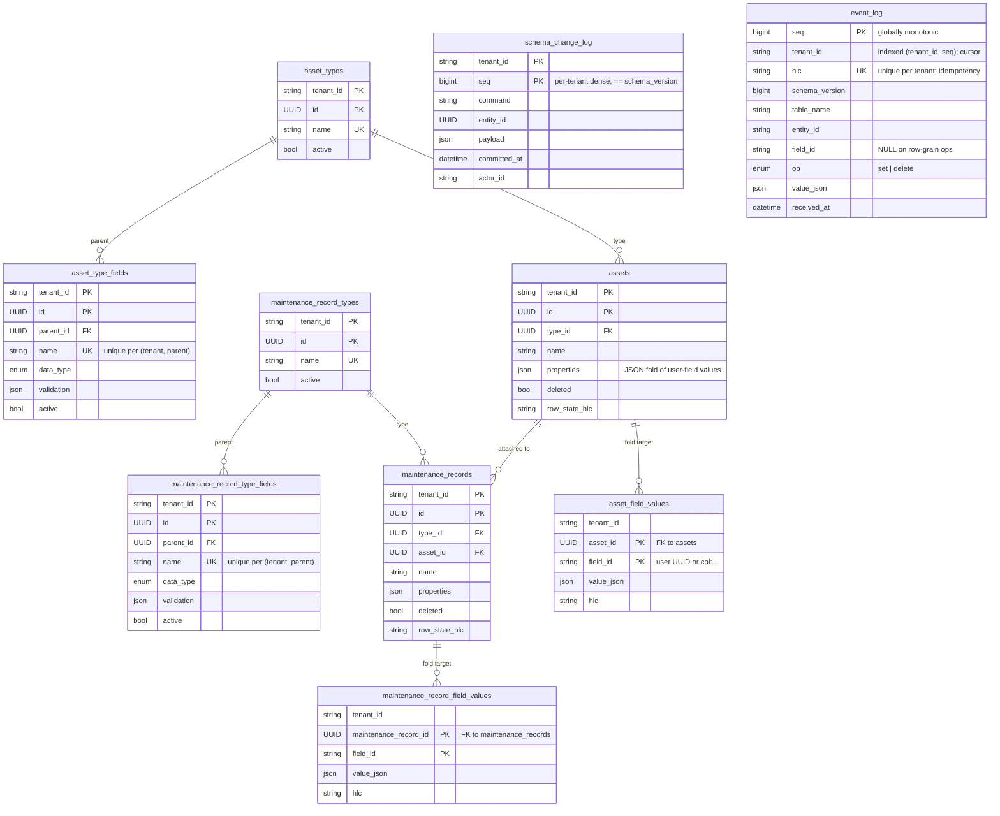
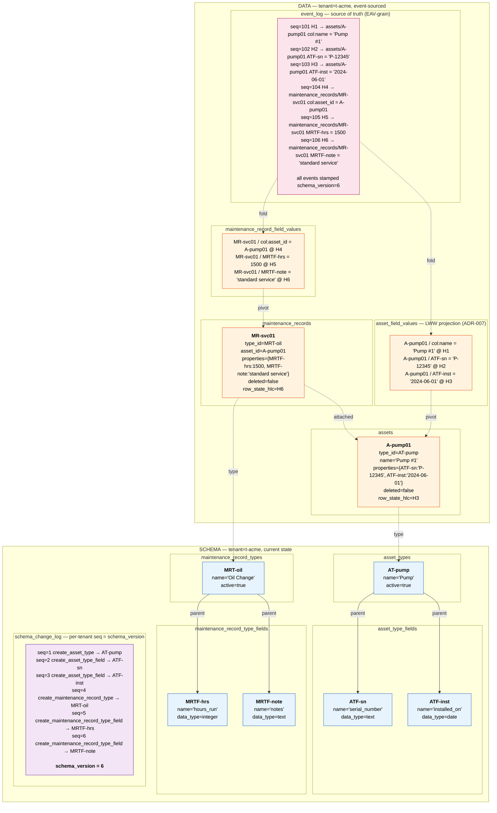

# Data model at a glance

Visual reference for novaMOC's meta-schema and the user-schema / user-data it
projects. Authoritative definitions live in the ADRs (see pointers at the
bottom); this page is the picture that ties them together.

## Meta-schema hierarchy

The model splits along the ADR-001 line: server-authoritative **schema** on
one side, event-sourced **data** on the other. Every synced row is
tenant-scoped (ADR-014) — `tenant_id` participates in every PK.



### What the diagram encodes

- **Two trees, mirrored shape.** `AssetType → AssetTypeField` mirrors
  `MaintenanceRecordType → MaintenanceRecordTypeField`; `Asset → AssetFieldValue`
  mirrors `MaintenanceRecord → MaintenanceRecordFieldValue`.
- **`MaintenanceRecord.asset_id` is the only cross-tree edge** — a record
  attaches to an asset.
- **`Asset.type_id` / `MaintenanceRecord.type_id`** are the cross-side edges
  from data back to schema.
- **Two logs, two grains.** `SchemaChangeLog` is command-grain (one row per
  accepted `POST /schema`) and is *not* folded — it's audit plus a per-tenant
  `seq` that **is** `schema_version` (ADR-008). `EventLog` is EAV-grain and
  **is** folded into the projections above (ADR-002 / 011 / 012).
- **Entity tables are projections.** `properties` (JSON) and the
  `*_field_values` rows are derivable from `EventLog`; the entity row's
  `row_state_hlc` is the row-grain LWW key for `deleted` / `name`.

<details>
<summary>ASCII fallback (same diagram, plain-text rendering)</summary>

```text
                              ┌───────────────────────────────┐
                              │   TENANT  (tenant_id)         │
                              │   every synced row is scoped  │
                              └───────────────┬───────────────┘
                                              │
                ┌─────────────────────────────┴─────────────────────────────┐
                │                                                           │
        ╔═══════▼══════════════╗                                 ╔══════════▼══════════════╗
        ║      SCHEMA          ║                                 ║          DATA           ║
        ║ server-authoritative ║                                 ║ bidirectionally synced  ║
        ║  ADR-005 / ADR-008   ║                                 ║ ADR-002 / 011 / 012     ║
        ╚═══════╤══════════════╝                                 ╚══════════╤══════════════╝
                │                                                           │
   ┌────────────┼────────────────┐                          ┌───────────────┼───────────────┐
   │            │                │                          │               │               │
   ▼            ▼                ▼                          ▼               ▼               ▼
┌──────────┐ ┌────────────────┐ ┌──────────────────┐  ┌──────────┐  ┌────────────────┐ ┌──────────────────────┐
│AssetType │ │MaintenanceRec- │ │ SchemaChangeLog  │  │  Asset   │  │MaintenanceRec- │ │      EventLog        │
│          │ │  ordType       │ │ append-only      │  │          │  │   ord          │ │ append-only, EAV-    │
│ id       │ │                │ │ command-grain    │  │ id       │  │                │ │ grain; SOURCE OF     │
│ name UQ  │ │ id             │ │ (tenant_id,seq)  │  │ type_id ─┼─►│ id             │ │ TRUTH for data       │
│ active   │ │ name UQ        │ │                  │  │ name     │  │ type_id ───────┼─┤                      │
└────┬─────┘ │ active         │ │ seq (= schema_   │  │ properties│ │ asset_id ──────┼─┤ seq (global PK)      │
     │1      └────────┬───────┘ │   version,       │  │   JSON   │  │ name           │ │ tenant_id            │
     │n               │1        │   per-tenant     │  │  projection│ │ properties JSON│ │ hlc                  │
     ▼                │n        │   dense)         │  │ deleted  │  │ deleted        │ │ schema_version       │
┌──────────────┐      ▼         │ command          │  │ row_state_hlc│ row_state_hlc  │ │ table_name           │
│AssetType-    │ ┌─────────────┐│ entity_id        │  └────┬─────┘  └────┬───────────┘ │ entity_id            │
│  Field       │ │MaintRec-    ││ payload (JSON)   │       │1            │1            │ field_id (or NULL)   │
│              │ │  TypeField  ││ committed_at     │       │             │             │ op (set | delete)    │
│ parent_id ──┐│ │             ││ actor_id         │       │n            │n            │ value_json           │
│ name UQ     ││ │ parent_id ─┐││                  │       ▼             ▼             │ received_at          │
│ data_type   ││ │ name UQ    │││ ──── plays the   │  ┌─────────────┐ ┌──────────────────┐                    │
│ validation  ││ │ data_type  │││ role of MAX(seq) │  │AssetField-  │ │MaintenanceRec-   │ folds → projections │
│  (JSON)     ││ │ validation │││  =               │  │  Value      │ │  ordFieldValue   │                    │
│ active      ││ │  (JSON)    │││  schema_version  │  │             │ │                  │ UNIQUE(tenant_id,   │
└────┬────────┘│ │ active     │││                  │  │ asset_id ───┘ │ maintenance_     │   hlc) idempotence  │
     └─FK──────┘ └────┬───────┘└──────────────────┘  │ field_id    │ │   record_id ─────┘ └───────────────────┘
                      └─FK→ parent_id→MaintRecType   │  (user UUID │ │ field_id           per-tenant cursor:
                                                     │   or "col:…")│ │ value_json        ORDER BY seq
                                                     │ value_json  │ │ hlc                WHERE tenant_id=…
                                                     │ hlc         │ └──────────────────┘
                                                     └─────────────┘     LWW projection
                                                       LWW projection    (ADR-007)
                                                       (ADR-007)
```

</details>

## Same shape, filled with example user-schema and user-data

Scenario: tenant `t-acme` defines a `Pump` asset type and an `Oil Change`
maintenance record type, then registers one pump and logs one service event.



Solid arrows are real FK edges; dotted arrows are projection edges (the
event-log fold → per-field LWW table → pivoted into the entity's `properties`
JSON).

### Things to read off the populated diagram

- **`schema_change_log.seq` ramps with every accepted `POST /schema`
  command** — six commands ⇒ `schema_version = 6`. Every event in `event_log`
  is stamped with the schema version it was authored against; the
  `POST /events` controller rejects whole batches whose `schema_version`
  doesn't match the tenant's current version (ADR-008 / ADR-009).
- **User-field columns are addressed by field UUID, not by name**
  (`ATF-sn`, `MRTF-hrs`, …). Renaming `serial_number` is a schema command that
  mutates `asset_type_fields.name`; existing events still resolve through the
  same `ATF-sn` UUID.
- **`col:` field-ids are the reserved namespace for entity-table columns**
  (`col:name`, `col:asset_id`). They appear in `event_log` and
  `*_field_values` the same way user-field UUIDs do; the projection fold
  routes them into named columns instead of `properties`.
- **Folding rule.** For each `(entity, field)`, the winning row in
  `*_field_values` is the one with the highest HLC (per-field LWW, ADR-007);
  `properties` JSON on the entity is the user-field rows pivoted into one
  document. Clearing a user field leaves the key in `properties` as JSON
  `null` (ADR-019, which revises ADR-012).
- **Idempotent replay.** `UNIQUE(tenant_id, hlc)` on `event_log` means
  re-delivering `seq=102` (same HLC) is a no-op; reordering by HLC still
  produces the same projection.

<details>
<summary>ASCII fallback (same diagram, plain-text rendering)</summary>

```text
TENANT: t-acme
│
├── SCHEMA (current state)
│   │
│   ├── asset_types
│   │     id=AT-pump,    name="Pump",       active=true
│   │
│   ├── asset_type_fields           parent_id=AT-pump
│   │     id=ATF-sn,     name="serial_number", data_type=text,    active=true
│   │     id=ATF-inst,   name="installed_on",  data_type=date,    active=true
│   │
│   ├── maintenance_record_types
│   │     id=MRT-oil,    name="Oil Change", active=true
│   │
│   ├── maintenance_record_type_fields    parent_id=MRT-oil
│   │     id=MRTF-hrs,   name="hours_run", data_type=integer,     active=true
│   │     id=MRTF-note,  name="notes",     data_type=text,        active=true
│   │
│   └── schema_change_log   (tenant_id=t-acme; per-tenant seq is the schema_version)
│         seq=1  command=create_asset_type            entity_id=AT-pump
│         seq=2  command=create_asset_type_field      entity_id=ATF-sn     payload={parent:AT-pump,name:"serial_number",data_type:"text"}
│         seq=3  command=create_asset_type_field      entity_id=ATF-inst   payload={parent:AT-pump,name:"installed_on",data_type:"date"}
│         seq=4  command=create_maintenance_record_type           entity_id=MRT-oil
│         seq=5  command=create_maintenance_record_type_field     entity_id=MRTF-hrs   payload={parent:MRT-oil,name:"hours_run",data_type:"integer"}
│         seq=6  command=create_maintenance_record_type_field     entity_id=MRTF-note  payload={parent:MRT-oil,name:"notes",    data_type:"text"}
│                                                               ── current schema_version = 6
│
└── DATA
    │
    ├── event_log   (source of truth; global seq, ordered per tenant by (tenant_id, seq); each event tagged with the schema_version it was authored against)
    │     seq=101  hlc=H1   schema_version=6  table=assets    entity=A-pump01   field=col:name        op=set     value="Pump #1"
    │     seq=102  hlc=H2   schema_version=6  table=assets    entity=A-pump01   field=ATF-sn         op=set     value="P-12345"
    │     seq=103  hlc=H3   schema_version=6  table=assets    entity=A-pump01   field=ATF-inst       op=set     value="2024-06-01"
    │     seq=104  hlc=H4   schema_version=6  table=maintenance_records  entity=MR-svc01  field=col:asset_id  op=set  value=A-pump01
    │     seq=105  hlc=H5   schema_version=6  table=maintenance_records  entity=MR-svc01  field=MRTF-hrs      op=set  value=1500
    │     seq=106  hlc=H6   schema_version=6  table=maintenance_records  entity=MR-svc01  field=MRTF-note     op=set  value="standard service"
    │
    ├── assets   (entity projection; properties is the JSON fold of the user fields below)
    │     id=A-pump01    type_id=AT-pump    name="Pump #1"
    │       properties = { ATF-sn: "P-12345", ATF-inst: "2024-06-01" }
    │       deleted=false   row_state_hlc=H3
    │
    ├── asset_field_values   (LWW projection — one row per (asset, field))
    │     asset_id=A-pump01   field_id=col:name      value_json="Pump #1"      hlc=H1
    │     asset_id=A-pump01   field_id=ATF-sn        value_json="P-12345"      hlc=H2
    │     asset_id=A-pump01   field_id=ATF-inst      value_json="2024-06-01"   hlc=H3
    │
    ├── maintenance_records
    │     id=MR-svc01    type_id=MRT-oil    asset_id=A-pump01    name=null
    │       properties = { MRTF-hrs: 1500, MRTF-note: "standard service" }
    │       deleted=false   row_state_hlc=H6
    │
    └── maintenance_record_field_values
          maintenance_record_id=MR-svc01   field_id=col:asset_id   value_json=A-pump01            hlc=H4
          maintenance_record_id=MR-svc01   field_id=MRTF-hrs       value_json=1500                hlc=H5
          maintenance_record_id=MR-svc01   field_id=MRTF-note      value_json="standard service"  hlc=H6
```

</details>

## ADR pointers

- ADR-001 — overall architecture, two data classes.
- ADR-002 / 011 / 012 / 019 — event-sourced data + EAV log + JSON projections;
  ADR-019 revises ADR-012's clears clause.
- ADR-005 / 008 — schema-as-data, server-authoritative meta-schema + command
  verbs.
- ADR-006 / 007 — HLC ordering and per-field LWW fold.
- ADR-014 — tenant-scoping via `tenant_id` columns.
